# <Projectname> NMA documentation

## Groupmembers
### Group 5
1. Kevin Demeulenaere
2. Clint Kindermans

## Project summary
Brief description about the project, 1 paragraph maximum.

We made an app were you can choose recipes based on the products you have in your pantry. If your pantry is empty you can still search recipes and build a shopping list based on the products you need for those recipes. It is also possible to add your own pictures to the ingredients.  
## Requirements
### ℹ️ Legend
- :heavy_check_mark: = Implemented
- :x: = Not implemented
- :hourglass: = Work in progress

|Status|Description|Details|
|---|---|---|
||**Must have (12/20)**||
|:heavy_check_mark:| Build a multiscreen app (at least 4 screens) using the Jetpack Navigation component
|:heavy_check_mark:| Use Jetpack Compose with Kotlin to build your screen layout (use at least 4 different elements with mandatory: a scrollable List, Button, Text and Image)
|:heavy_check_mark:| Create a menu-based navigation and bottom navigation
|:heavy_check_mark:| Use the Android app architecture (ViewModel – State in Compose)
|:heavy_check_mark:| Use a local Room database to store user data persistently
|:heavy_check_mark:| Use Retrofit to communicate with an API service
|:heavy_check_mark:| Schedule at least 1 background task using the Workmanager
|:heavy_check_mark:| Use at least 2 Implicit Intents
|:heavy_check_mark:| Write significant tests to make a robust app (code coverage at least 90%)
|:heavy_check_mark:| Implement a custom application theme using MaterialDesign with a custom app icon
|:heavy_check_mark:| Generate an installable APK
||
|| **Intermediate - self learning topics (14+/20)**
|:heavy_check_mark:| Notifications
|:heavy_check_mark:| Canvas and animations
|:x:| Sensor data (GPS, motion, position, environmental)
|||
||**Experienced - self learning topics (16+/20)**
|:heavy_check_mark:| Use the CameraX library
|:x:| Use the ML Kit to add new experience features to your app (Vision and/or Natural Language API)

## Overview app
## Screenshots
Screenshots for every screen in the application:

### Main Screen and Screen 2
|  | 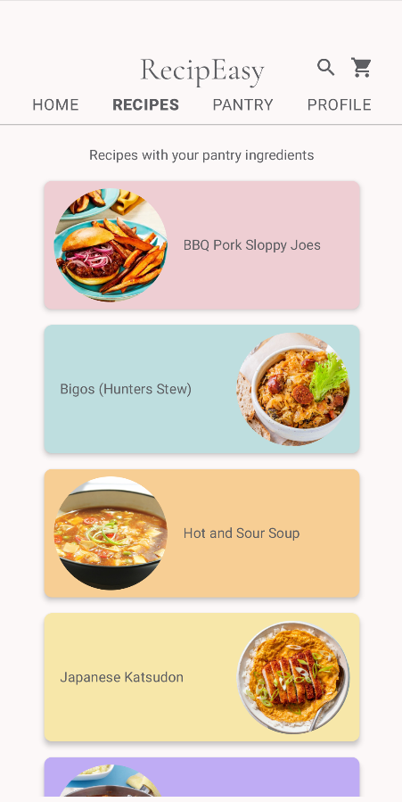 |
|-------------------------|------------------------|

### Screen 3 and Screen 4
| 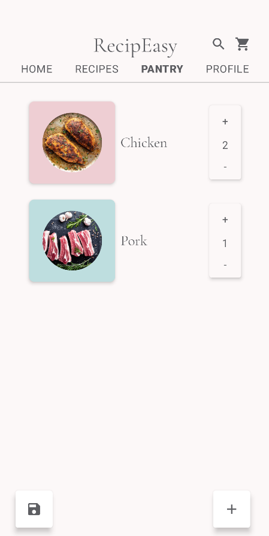 | 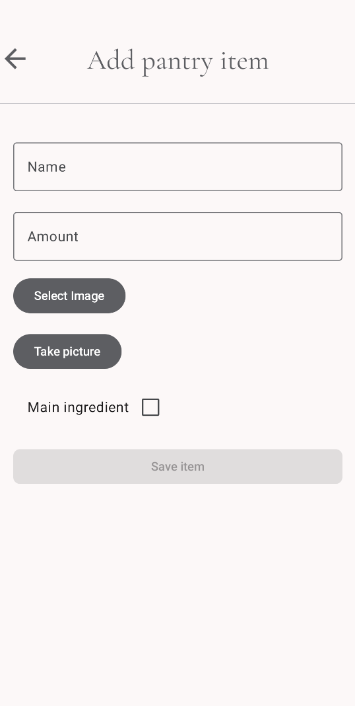 |
|------------------------|--------------------------------|

### Screen 5 and Screen 6
| 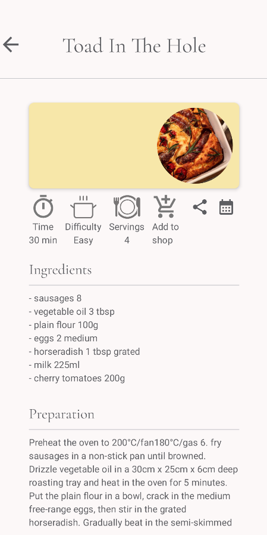 | 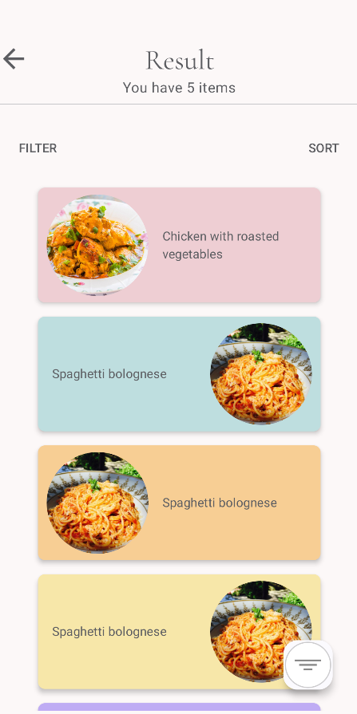 |
|------------------------|-------------------------|

### Screen 7

## Room Database
Type of data stored in the database used in screen x and displayed in screen y.

| 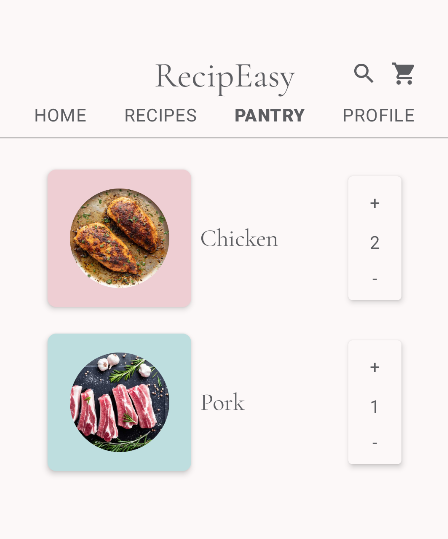 | 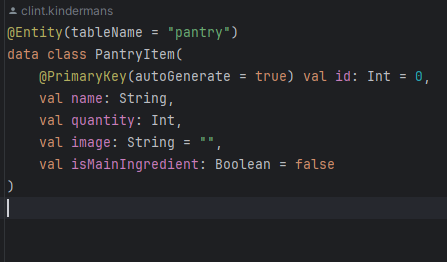 |
|---------------------------------|--------------------------------|

## API Request
Request to server x retrieving JSON in the following format displayed in screen x.

### API Request Screenshots
|  |  |
|-----------------------------|------------------------------|
|  |  |
| 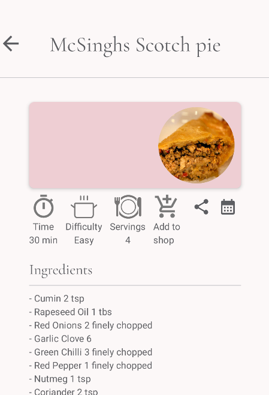 |

## Intents

### Detail Intent 1
|  |  |
|----------------------------------|----------------------------------|
| 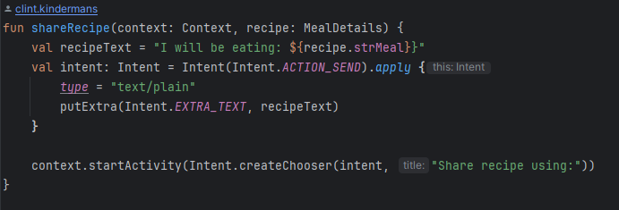 |

### Detail Intent 2
|  |  |
|----------------------------------|----------------------------------|
| 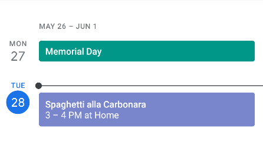 |  |

## WorkManager
Implementation of the background task in the WorkManager.

| 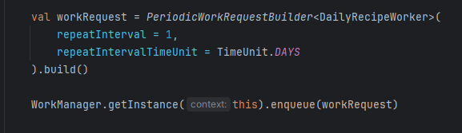 |  |
|------------------------------|------------------------------|

## Notifications
Optional: implementation of notifications.

|  |  |
|-------------------------------|-------------------------------|

## Canvas and Animations
Optional: implementation of canvas and animations.

| 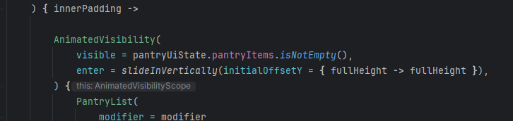) | 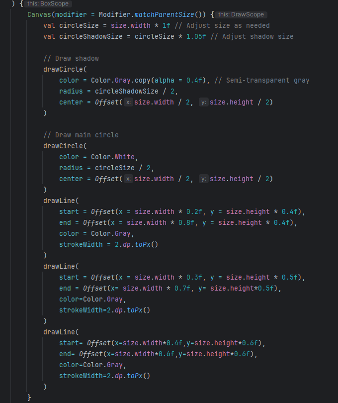 |
|------------------------------------------|------------------------------|

## Sensor Data
Optional: implementation of sensor data.

## Camera
Optional: implementation of the camera.

| 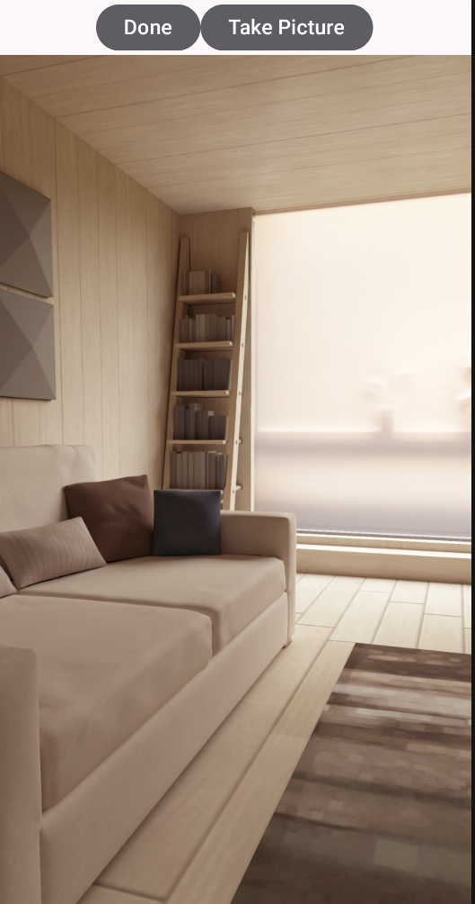) | 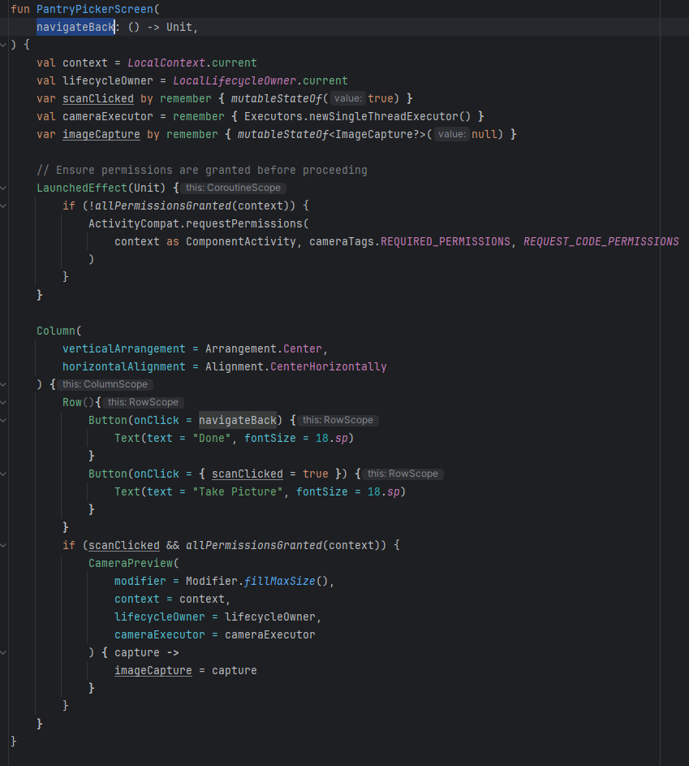 |
| 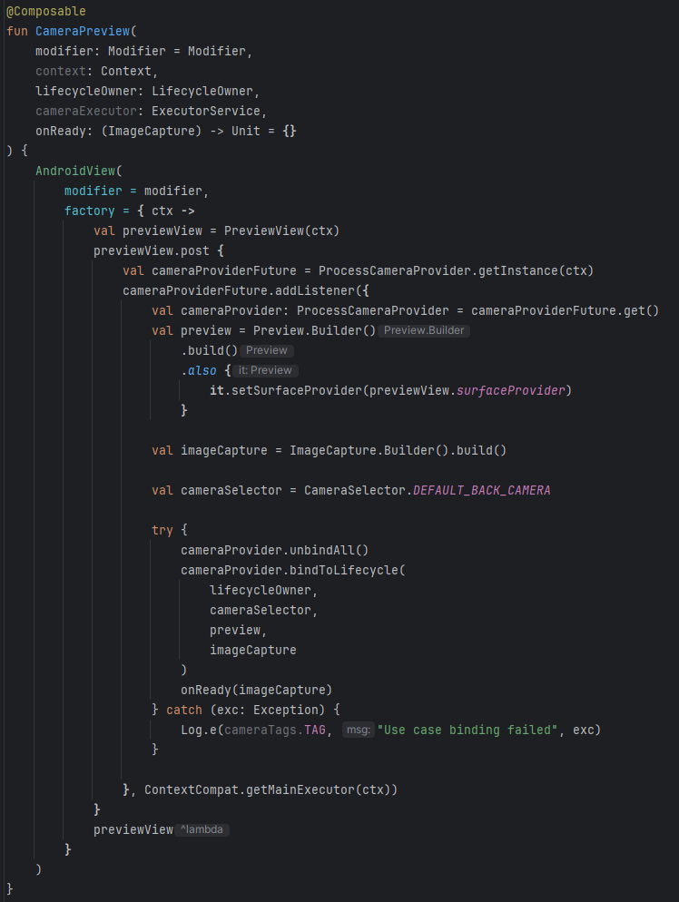) | 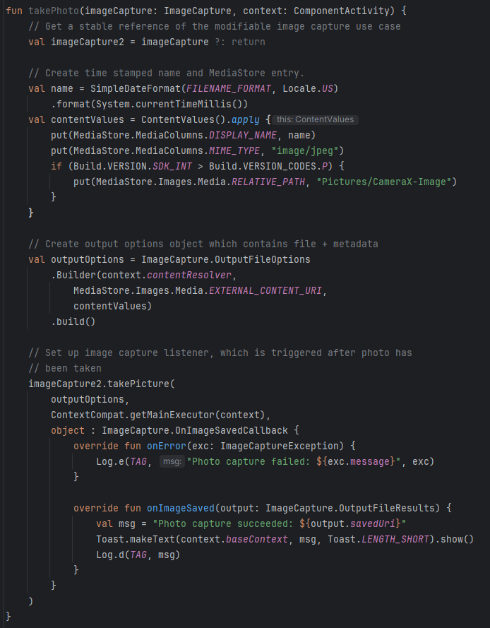 |
|------------------------------------------|------------------------------|

## ML Kit
Optional: implementation of the ML kit.

## Repositories
- Code
    - https://gitlab.ti.howest.be/ti/2023-2024/s4/native-mobile-apps/projects/group-05/recip-easy
- APK
    - https://gitlab.ti.howest.be/ti/2023-2024/s4/native-mobile-apps/projects/group-05/recip-easy-apk

## Link movie
- https://www.youtube.com/watch?v=SdDPUMXxJPo

## Link to Google profile accounts
- Member1 - https://g.dev/aguilaaa

- Member2 - https://g.dev/clint-kindermans
- Member2 - https://g.dev/zarlian